# Awesome Robot Agents — Embodied AI & Robot Manipulation

**A source-aware directory of embodied AI agents for robotic manipulation.** It tracks GPT-6 Astra and other LLM/VLM systems across robot arms, grasping, simulation, and real-world demonstrations, with links to their decisions, execution interfaces, available code, and supporting evidence. As GPT-6 Astra brings renewed attention to this direction, the collection follows how the field develops across models and arms.

## Contents

- [Robot-arm projects](#robot-arm-projects)
- [Tools and evaluation](#tools-and-evaluation)
- [Further reading](#further-reading)
- [Original demonstrations](#original-demonstrations)
- [Contribute](#contribute)

## What this collection covers

An embodied-AI agent adds a reasoning and tool-use layer to the robot-control stack. An LLM/VLM may interpret a task, choose robot skills, and delegate precise motion to a low-level controller or policy. This differs from an end-to-end policy or VLA that maps observations directly to actions.

Entries identify the robot or simulator, execution interface, available code or demonstrations, and important evidence limits. Results remain author-reported unless a documented maintainer rerun is available.

## Robot-arm projects

### SafeHarness — Coding Agents with an Obstacle-Aware Harness for Safe Robot Manipulation

SafeHarness adds two safety mechanisms to a coding-agent manipulation harness: it plans and geometrically verifies waypoint routes with replanning, and selects obstacle-aware contact poses for grasping and placement. On the SafeLIBERO simulation benchmark, the authors report 71.9% task success and 87.5% collision avoidance over 32 tasks with 10 seeds each, using GPT-6 with a frozen `π₀.₅` policy and Harness VLA skills. In the same-agent ablation, adding SafeHarness raises task success from 31.0% to 71.9% and collision avoidance from 59.0% to 87.5%. This is simulation evidence, not a real-robot result; 12.5% of episodes still displaced the obstacle. The paper does not currently link a public implementation.

**Source:** [Paper](https://arxiv.org/abs/2609.20822) · [Full text](https://arxiv.org/html/2609.20822v1)

<a href="https://arxiv.org/abs/2609.20822">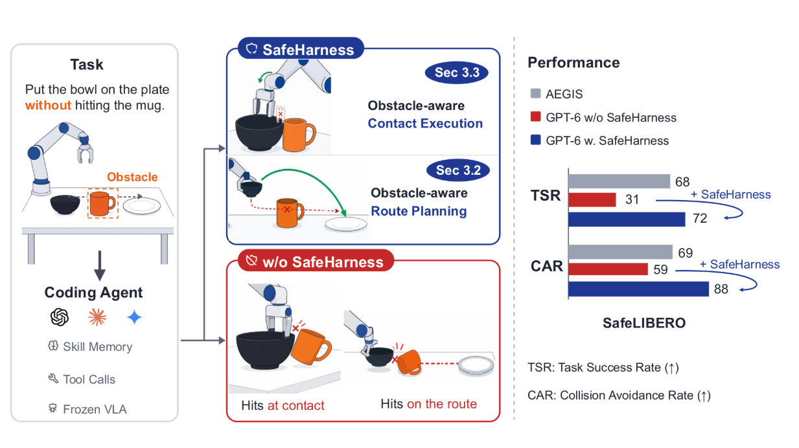</a>

*Figure: SafeHarness route-planning and contact-execution examples and reported SafeLIBERO results. Image provided by the contributor; performance figures are author-reported simulation results.*

### RoboDawn — Transferring the Intelligence of VLMs to Robotic Control

RoboDawn gives a frozen VLM a compact interface of discrete translation, rotation, and gripper commands, then uses visual observations and execution feedback for closed-loop manipulation. The authors report 73.6% success for GPT-6 Astra with one in-context demonstration versus 53.2% zero-shot on RoboTwin 2.0 C2R, and 47.17% versus 35.67% on RoboDojo. The technical report also describes zero-shot physical trials on Franka (9/10 block-in-basket, 5/10 block stacking) and dual Piper cloth folding (0/10). These are author-reported results; code is marked as forthcoming, and the real-robot trial counts are small.

**Source:** [Project and technical report](https://robodawn.top/) · [Recorded episodes and results](https://robodawn.top/results/) · [Report PDF](https://robodawn.top/RoboDawn.pdf)

<a href="https://robodawn.top/results/">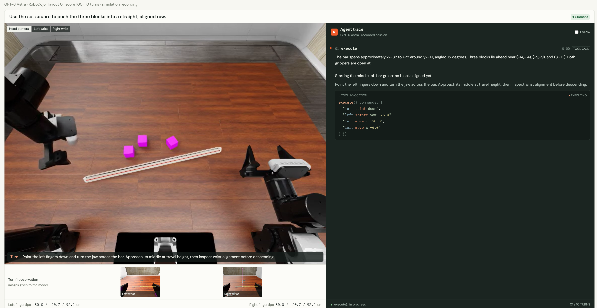</a>

*Figure: RoboDawn simulation recording showing the task scene, agent trace, tool call, and observation views. Screenshot provided by the contributor.*

### Agent as Policy for Robotic Manipulation (AGP)

AGP places task planning and execution under a general-purpose coding agent: it reads robot-camera observations and state, writes and runs programs, issues Cartesian or joint-space commands through a documented interface, and revises actions from physical feedback. On an I2RT YAM setup, the authors report 57 successful trials out of 62 across eight main-result configurations; a separate released dataset contains 162 real-robot trials and should not be conflated with that headline evaluation. The results are author-reported and each configuration has limited trials; the project publishes per-trial material for inspection.

**Source:** [Project page and results](https://agent-as-policy-2026.github.io/) · [Paper](https://arxiv.org/abs/2609.12541) · [Code](https://github.com/agent-as-policy-2026/agent-as-policy) · [Trial dataset](https://huggingface.co/datasets/Agent-as-Policy/agent-as-policy)

### GPT-6 Astra as an Embodied Policy

A comparative study of GPT-6 Astra as a direct robot policy and as a high-level reviewer or correction layer for the learned `π₀.₅` policy. The public evaluation covers RoboDojo tasks and compares direct end-effector control with hybrid System-2 reasoning plus System-1 sensorimotor skills. The repository reports Astra Direct at 26% success with a mean score of 37.81, and the hybrid policy at 48% success with a mean score of 62.60; GPT corrections were applied to 14.4% of executed control steps. These are author-reported evaluation results across selected cases, not evidence of general robot competence, and the public release does not represent every deployment or evaluation artifact.

**Source:** [Repository and code](https://github.com/anonymous-report-421/GPT-as-Policy) · [Project page](https://anonymous-report-421.github.io/public-website/) · [Astra embodied-AI index](https://github.com/zjwzcx/Awesome-Astra-Embodied-AI)

<a href="https://anonymous-report-421.github.io/public-website/?view=1">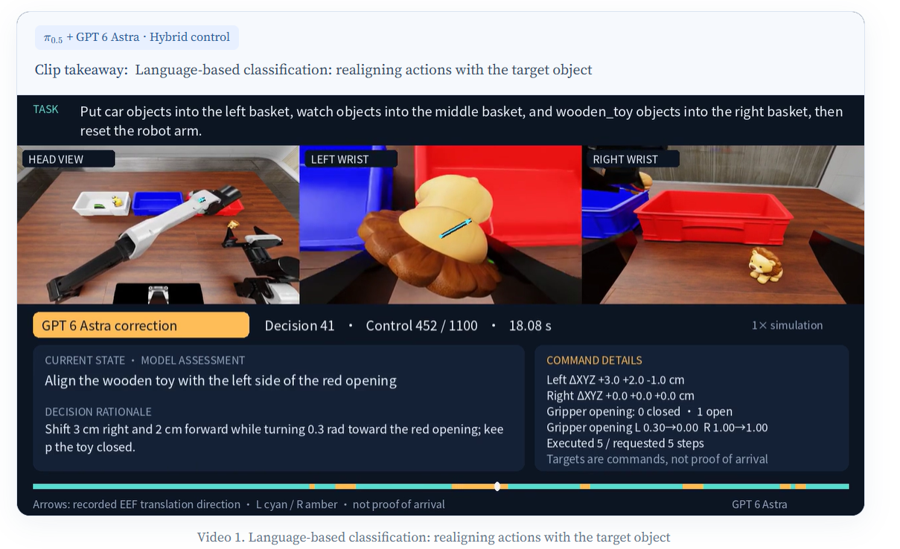</a>

*Figure: GPT-6 Astra correction in the hybrid-control loop, with task state, decision rationale, command details, and recorded end-effector control. User-provided image based on the project presentation.*

### GPT-Policy — In-Context Robot Learning with VLM Agents

An open-source closed-loop framework for in-context robot learning with VLM agents. The agent can use demonstrations, target images, interaction history, and execution feedback without gradient updates or task-specific parameter changes. The public repository provides adapters for ARX X5 and I2RT/YAM robot arms, structured robot-tool actions, IK checks, gripper and waypoint control, feedback-driven replanning, and append-only run recording. The paper reports author-run real-robot results across six tasks; the public tree does not include all deployment hosts, private prompts, calibration, run recordings, or the complete evaluation environment.

**Source:** [Repository and code](https://github.com/cheng-haha/GPT-Policy) · [Paper](https://arxiv.org/abs/2609.19138) · [Project page](https://cheng-haha.github.io/GPT-Policy/)

<a href="https://cheng-haha.github.io/GPT-Policy/">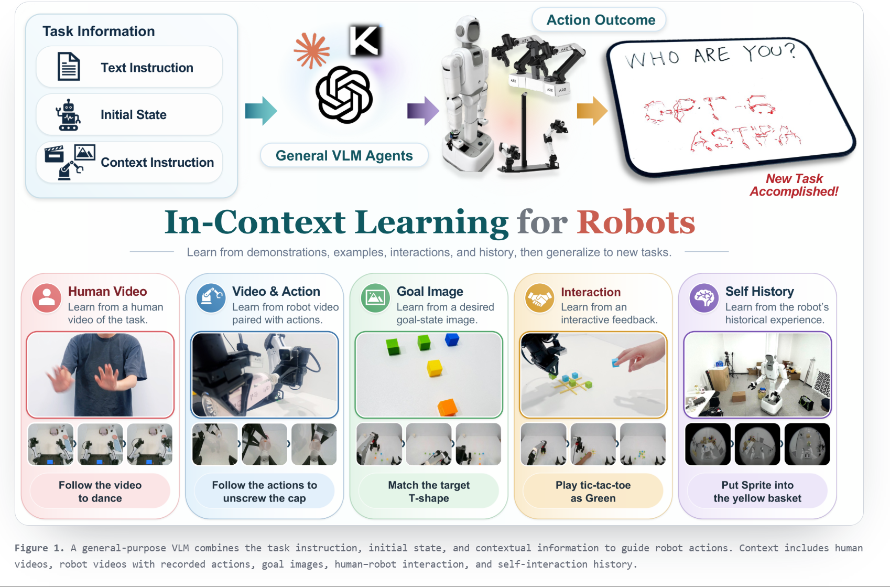</a>

*Figure: GPT-Policy combines task information with human video, robot video and action, goal images, interaction feedback, and self-history to guide robot actions. User-provided image based on the project presentation.*

### Cortex / InternVLA-M1.5 — A Bidirectionally Aligned Embodied Agent Framework for Long-Horizon Manipulation

An embodied-agent framework for long-horizon manipulation that aligns a high-level System-2 planning agent with low-level execution through a shared subtask interface. The project describes 32 canonical manipulation skill primitives and releases long-horizon subtask annotations across robot datasets and benchmarks. Dataset coverage, model results, and real-robot claims should be checked against the project paper and released evaluation setup.

**Source:** [Repository and code](https://github.com/InternRobotics/Cortex)

<a href="https://github.com/InternRobotics/Cortex">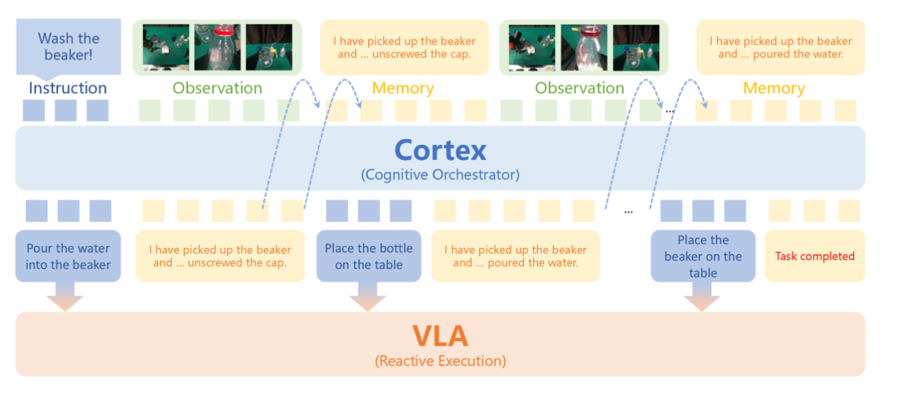</a>

*Figure: Cortex demonstrations and system overview for long-horizon robot manipulation. User-provided image based on the project presentation.*

### Show-Harness — Just a VLM Agent Can Play Robots

A released, model-flexible VLM harness for robot-arm manipulation. The VLM selects bounded action units; robot-specific interpreters turn them into motion for Franka or Piper arms, or for supported simulators. The recent public release adds the GUMI data collectors, plugins, training pipeline, LoRA adapters, and demonstration data. The authors provide [code, setup guides, and model/data links](https://github.com/showlab/Show-Harness). A public run guide and reported zero-shot or fine-tuned results are starting points, not maintainer-verified hardware evidence.

**Source:** [Project and code](https://github.com/showlab/Show-Harness)

<a href="https://github.com/showlab/Show-Harness">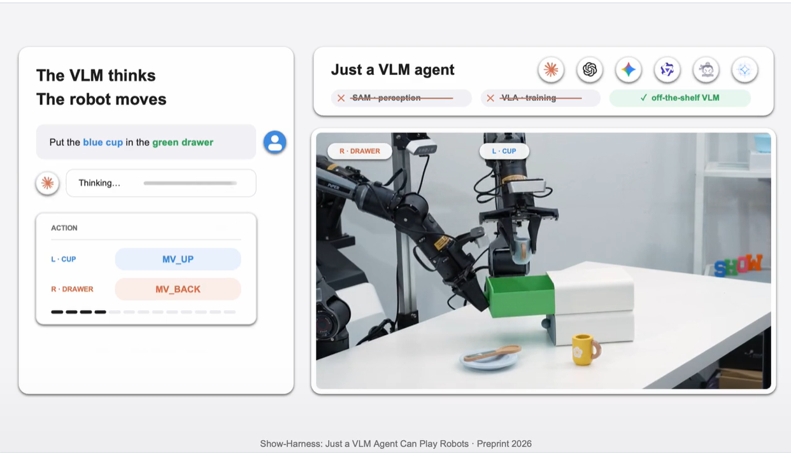</a>

### Pigey — Physical Agency

A closed-loop VLM orchestrator that routes high-level reasoning through frozen robot skills. The project reports LIBERO-PRO simulation results and Franka FR3 real-robot tasks, with code and a paper linked from the project page.

**Source:** [Project and demos](https://lianegalanti.github.io/Pigey/)

<a href="https://lianegalanti.github.io/Pigey/">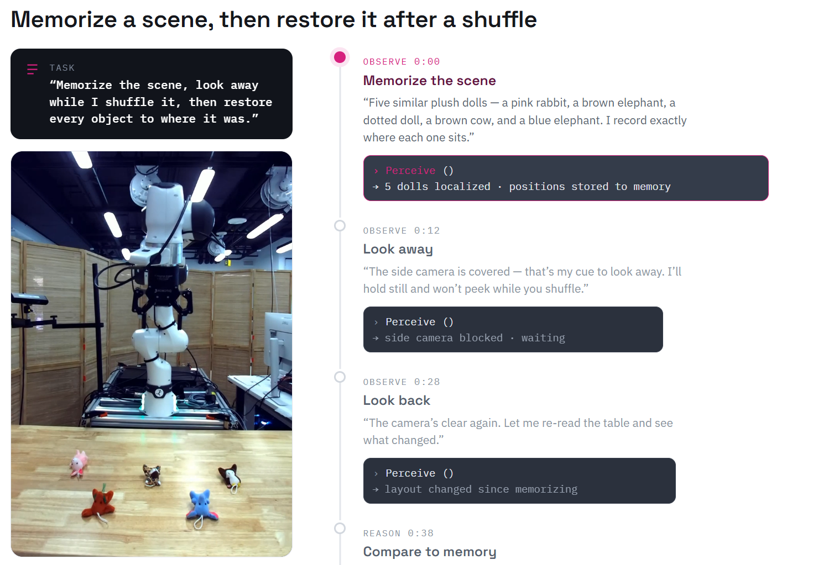</a>

*Project-page screenshot supplied by the contributor. [Author-reported demonstration](https://lianegalanti.github.io/Pigey/): remember five dolls’ positions, look away while they are shuffled, then restore the scene using the stored positions.*

### ENPIRE

An open agentic framework for coding agents to improve real-world robot policies through repeated reset, execution, verification, recording, and refinement. It provides hardware-free examples plus workflows for calibrated physical stations; real-robot use requires the project's own safety and authorization preflight.

**Source:** [Repository](https://github.com/NVlabs/ENPIRE)

<a href="https://github.com/NVlabs/ENPIRE">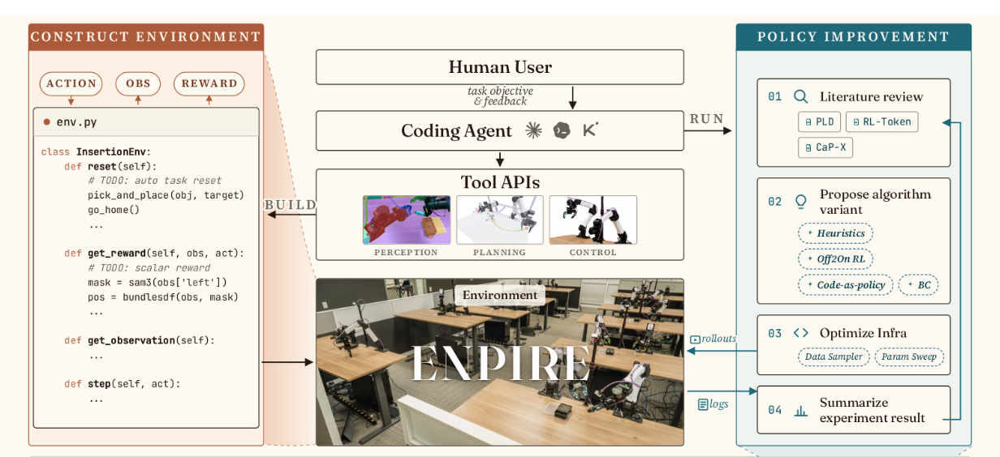</a>

### GPT-Policy-Eval

An author-reported real-robot preview of GPT-6 Astra using a demonstration video and live visual feedback for plug insertion. The [project and videos](https://github.com/cheng-haha/GPT-Policy-Eval) are public; code and systematic evaluation are still planned. The checked README does not specify the robot model or exact action interface.

**Source:** [Project](https://github.com/cheng-haha/GPT-Policy-Eval) · [Video](https://github.com/cheng-haha/GPT-Policy-Eval/raw/refs/heads/main/assets/plug-insertion-top-and-right-wrist.mp4)

### Robocurve Astra arm comparison

GPT-6 Astra plans and calls motion skills through Inspect Robots on real YAM arms. The [report and trial records](https://openai.robocurve.org/gpt-6-astra/) describe a two-task comparison with Claude models. The authors report 19/20 bowl-task completions and 2/20 puzzle-task completions for Astra; these tasks do not establish general robot competence.

**Source:** [Report and trial records](https://openai.robocurve.org/gpt-6-astra/) · [Video](https://openai.robocurve.org/gpt-6-astra/video/bowl-astra-vs-fable51-cost.mp4)

<a href="https://openai.robocurve.org/gpt-6-astra/video/bowl-astra-vs-fable51-cost.mp4">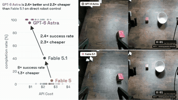</a>

## Tools and evaluation

Tools for connecting or evaluating robot agents.

- [RoboDojo](https://github.com/RoboDojo-Benchmark/RoboDojo) — an evaluation-only sim-and-real manipulation benchmark with 42 simulation tasks and 18 physical-robot tasks across three embodiments. The September 16–17, 2026 maintenance update corrected an observation-frame discrepancy and RGB byte-channel ordering; the maintainers report reruns left results essentially unchanged. Use XPolicyLab commit `bb9a0b5` or later for the aligned RGB ordering.
- [FailBench](https://arxiv.org/abs/2609.03611) — benchmark for VLM-based robot failure detection; tests whether VLMs can judge manipulation success across diverse real and simulated sources. The best reported mean balanced accuracy is 0.77, with performance near chance on contact-intensive tasks.
- [ENACT](https://enact-embodied-cognition.github.io/) — benchmark and dataset for evaluating VLM embodied cognition through forward and inverse world modeling of egocentric interaction. It includes code, data, a viewer, and a leaderboard; its scope is broader mobile manipulation and world modeling rather than a robot-arm execution interface.
- [Inspect Robots](https://github.com/robocurve/inspect-robots) — connects an agent or policy to a robot, task, and run logs. Version 0.58.0 adds on-demand camera mode for agents, exposes affirmative operator verdicts as a public scorer API, and improves validation and retention of rollout/evaluation logs. Its mock quick start checks the pipeline, not physical manipulation; see the [LLM-agent guide](https://github.com/robocurve/inspect-robots#drive-the-robot-with-an-llm) and [v0.58.0 release notes](https://github.com/robocurve/inspect-robots/releases/tag/v0.58.0).
- [ROS MCP Server](https://github.com/robotmcp/ros-mcp-server) — exposes ROS topics, services, and actions to an MCP client. It provides an interface, not the robot controller itself.
- [StationeryBench](https://github.com/robocurve/stationerybench) — five bimanual desk-manipulation tasks (uncap a marker, retrieve an eraser, extract a sticky pad, pour paper clips, and hand over a ruler), with setup references, human demos, checklists, and 20-episode real-YAM run instructions. Built on Inspect Robots for both VLA and LLM-agent policies. The included mock has no physics, and its scripted oracle uses privileged state; neither is evidence of a model's physical manipulation ability. The package's binary operator score differs from the staged video grading in the associated report.
- [FluxVLA](https://github.com/FluxVLA/FluxVLA) — a VLA training, evaluation, and deployment platform used as a low-level policy/backend in some agent workflows, not an LLM agent itself. September 2026 updates add GPT-6 inference and checkpoint-free LIBERO evaluation, native GR00T N1.7 training/evaluation, and horizon-aligned RoboCasa action denormalization. These are platform capabilities; they do not establish LLM-agent performance or new physical-robot results.

## Further reading

- [OpenAI: GPT-6 Astra](https://openai.com/index/gpt-6-astra/) — the original announcement and system overview.
- [Robot-Use Agents](https://web.mit.edu/phillipi/www/writing/robot-use-agents.html) — a perspective on using language models as tools for robots, including the distinction between high-level reasoning and low-level control.
- [Awesome Robot Use Agent](https://github.com/kairunwen/Awesome-Robot-Use-Agent) — a broader catalogue of robot-use-agent papers, projects, benchmarks, and community demonstrations; useful as a discovery index alongside this robot-arm-focused collection.

## Original demonstrations

Author-created demonstrations; code and technical details are linked when available.

| Media | Source | Reported task |
| --- | --- | --- |
| <a href="https://x.com/DJiafei/status/2096601096705995155">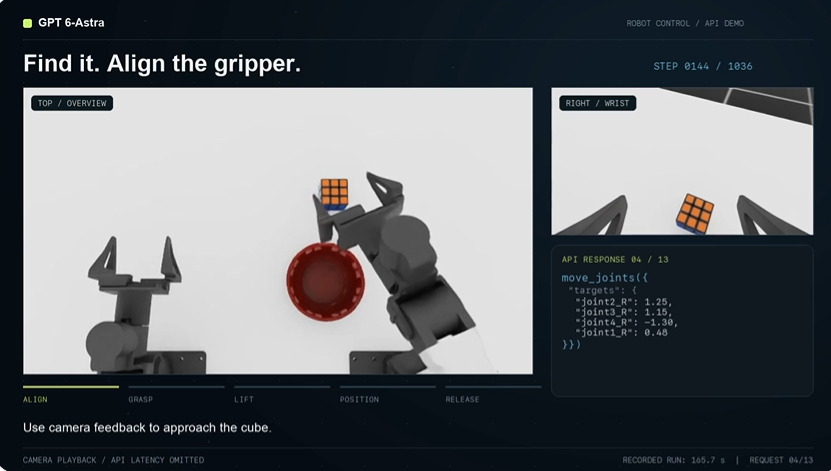</a> | Jiafei Duan — [Original post](https://x.com/DJiafei/status/2096601096705995155) [MolmoAct2 sim_eval](https://github.com/allenai/molmoact2/tree/main/sim_eval) | Tabletop grasp and place in simulation |
| <a href="https://x.com/RotekSong/status/2099104628562608371">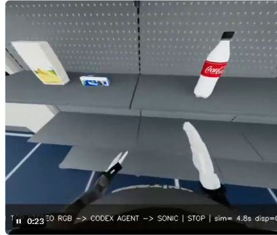</a> | RotekSong — [Original post](https://x.com/RotekSong/status/2099104628562608371) | G1 cola-bottle pick-up in Isaac Sim |
| <a href="https://x.com/kaiwynd/status/2098823484474348008">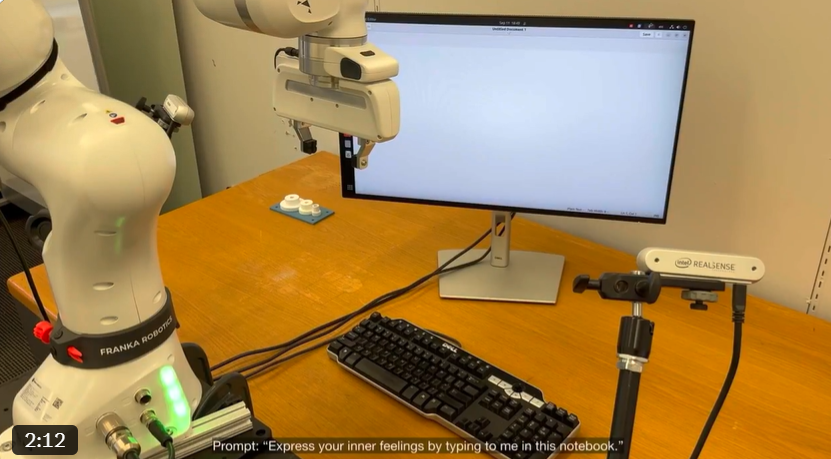</a> | Kaifeng Zhang — [Original post](https://x.com/kaiwynd/status/2098823484474348008) | Real-robot keyboard interaction with visual feedback; Astra learns to type after repeated attempts |
| 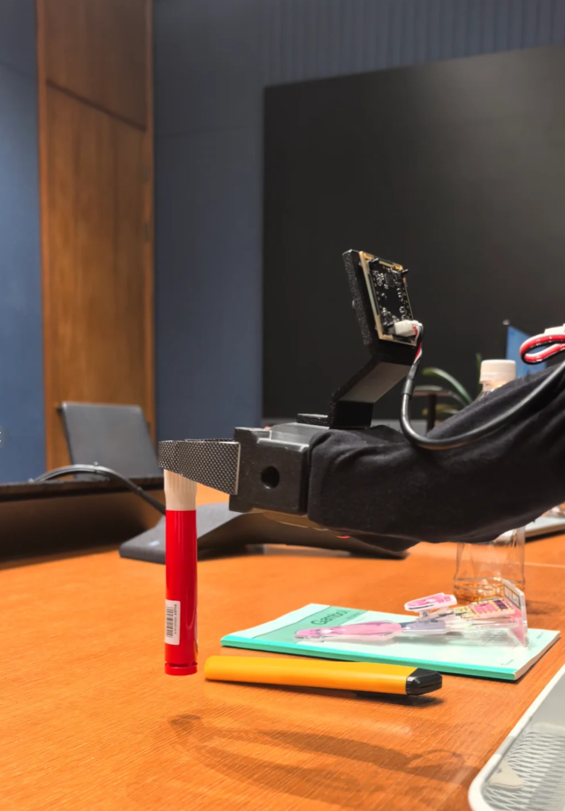 | star大小变 — [Original post](https://www.rednote.com/discovery/item/6aa4d7e200000000260145ff?source=web_profile_page&xsec_source=pc_search&xsec_token=ABur_B60E14GxVQp2ei3USGtEElW40SN75Vj5aB_USVUA%3D) | Low-level robot-arm marker grasp |
| 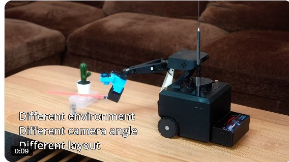 | Axel — [Original post](https://x.com/ax_pey/status/2098216469012283681) [Code PR](https://github.com/innate-inc/innate-os/pull/817) | Video-based in-context learning for mobile manipulation across environments, camera views, and layouts; Astra chooses end-effector or joint-space control without a text prompt |
| 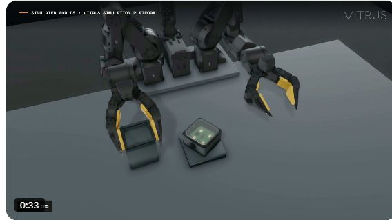 | Lucas Cassiano — [Original post](https://x.com/lucascassiano/status/2097830777438486557) | Rapid adaptation to an unseen robot embodiment |
| 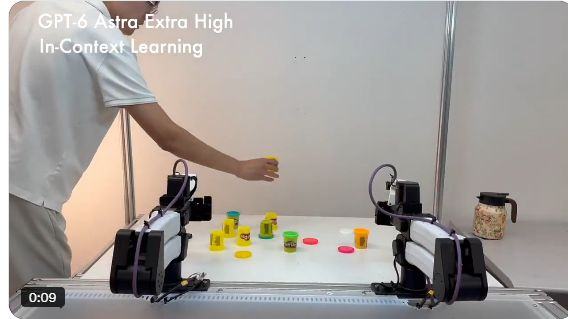 | Tonghe Zhang — [Original post](https://x.com/TongheZhang01/status/2097801107602911243) [ENPIRE](https://github.com/NVlabs/ENPIRE) | Robot in-context learning through the ENPIRE harness |
| 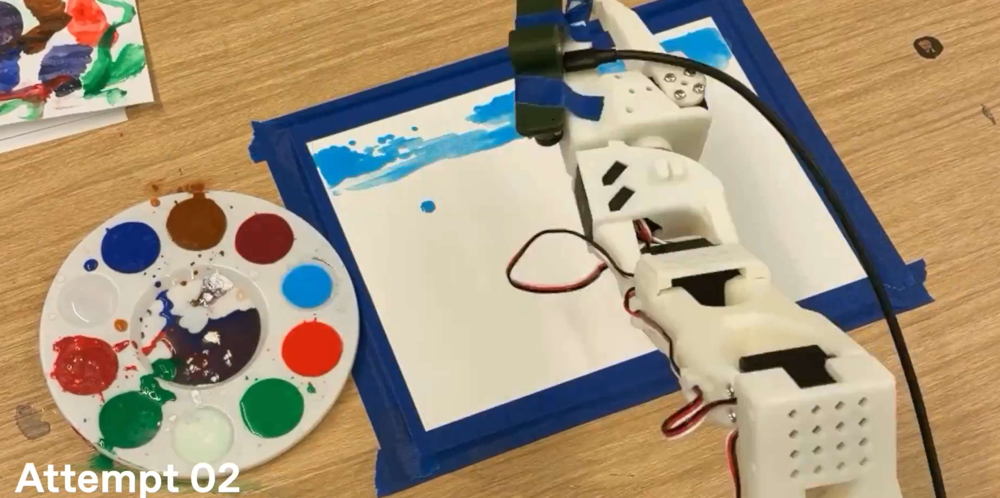 | thijs — [Original post](https://x.com/cdngdev/status/2097339677128982873) | Painting task from a semantic prompt |
| 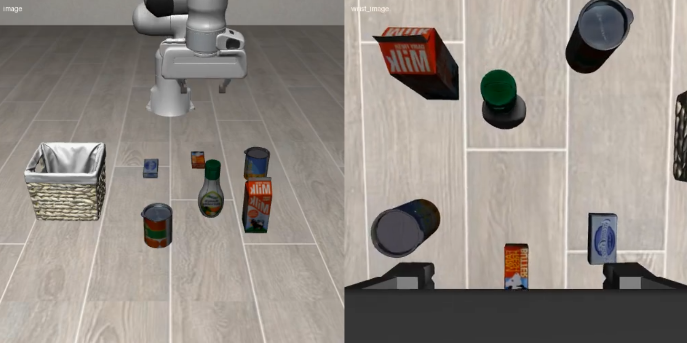 | Jikun — [Original post](https://www.rednote.com/discovery/item/6aa16835000000000b00f46d?source=web_profile_page&xsec_source=pc_search&xsec_token=ABDcu5eBZZYkAUcveAv8IZNWsbLmXk6CUM5u5BhDPODB0%3D) [FluxVLA](https://github.com/FluxVLA/FluxVLA) | Astra planning with a pretrained embodied policy |
| 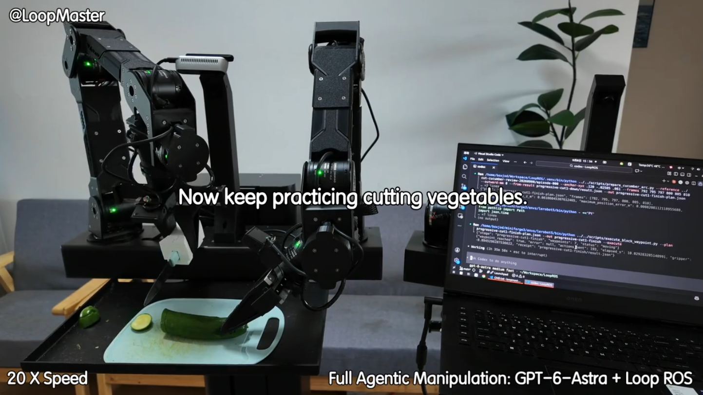 | 盒子桥 — [Original post](https://www.rednote.com/discovery/item/6aa0c4900000000012034a2f?source=webshare&xhsshare=pc_web&xsec_token=ABYB6HItIwwYq0Yyi9-hwoM-vMalkFRmYMAkN0iUWpTM4=&xsec_source=pc_share) [LoopMaster](https://loopmaster.ai/) | Real-arm cucumber slicing through Loop-ROS |
| 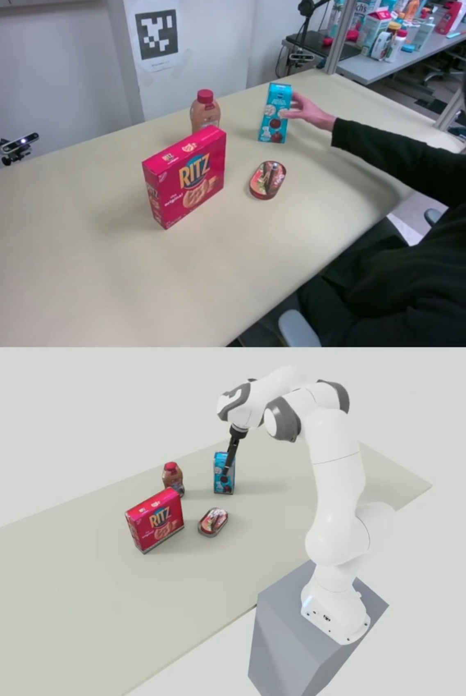 | 应物而无累 — <a href="https://www.rednote.com/discovery/item/6aa8985a000000002a02f022?source=webshare&xhsshare=pc_web&xsec_token=ABVaBndlmLfLukTWqmYV_Z_deDleX-ebQ1EIyqCo1cfy4=&xsec_source=pc_share">Original post</a> | Video-to-simulation asset reconstruction followed by robot-arm control |
| 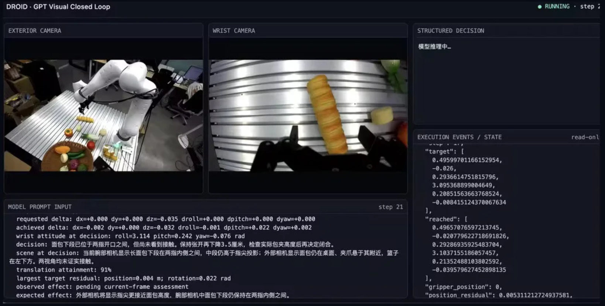 | Loule — <a href="https://www.rednote.com/discovery/item/6a9fc0710000000029015578?source=webshare&xhsshare=pc_web&xsec_token=ABMaVBcBS54ctuQIxmhMJMZSAU7Wspgd3bmCnb4tQqHsU=&xsec_source=pc_share">Original post</a> | Real-arm bread pick and place using end-effector poses |
| 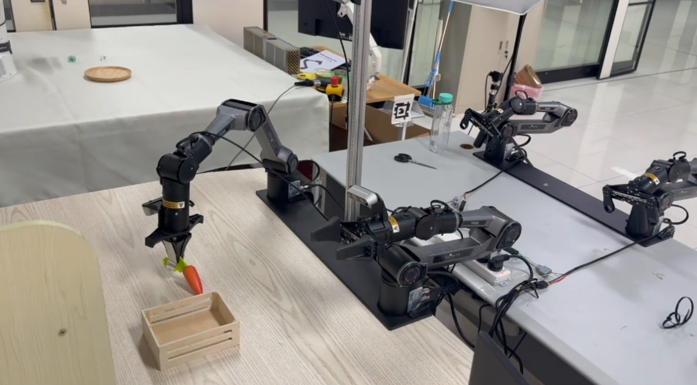 | 虽然不但是 — <a href="https://www.rednote.com/discovery/item/6a9bd4c80000000028037f67?source=webshare&xhsshare=pc_web&xsec_token=ABLUcokp8Tzdy13Avv1khxst1pWqWBaR7JLjQhUhWsSs4=&xsec_source=pc_share">Original post</a> | Piper pick and place with GPT-6 and RealSense |
| <a href="https://qinengwang-aiden.github.io/demos/constraint_demos/">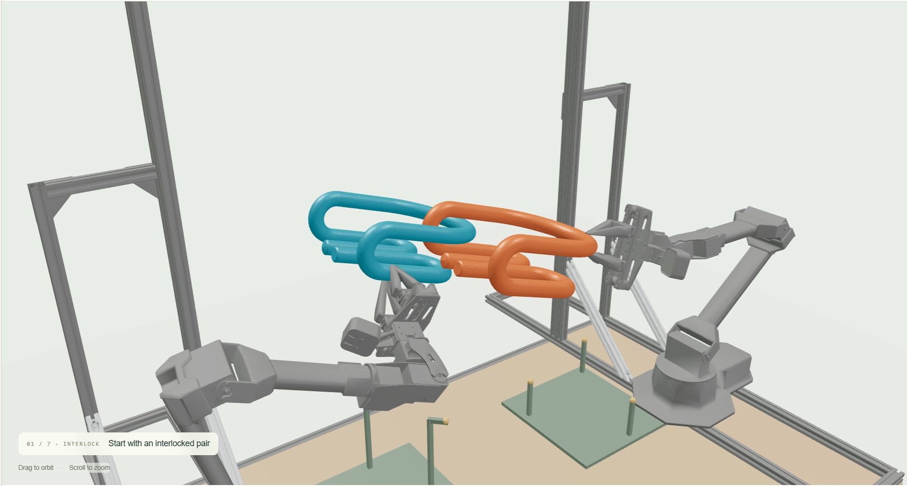</a> | Qineng Wang — [Original post](https://x.com/qineng_wang/status/2099893504658866561) [Methods and evidence](https://qinengwang-aiden.github.io/demos/constraint_demos/methods.html) [Interactive demo](https://qinengwang-aiden.github.io/demos/constraint_demos/) | GPT-6 Astra spatial-constraint demonstrations: unlocking interlocked parts and threading a rope through three rings in Dual ALOHA kinematic replay; the page describes pregrasped motion with ideal grasps, so this is not physical-hardware validation |

Demonstrations can be expanded into full entries when supporting code or technical details become available.

## Contribute

Suggest a project related to **LLM/VLM agent participation in robot-arm manipulation** through an [issue](https://github.com/Lin-Murphy/Awesome-Robot-Agents/issues) or the [contribution instructions](CONTRIBUTING.md). Include the model's decision, execution interface, robot or simulator, available code or demos, and key evidence limits.

## Attribution and license

The [MIT license](LICENSE) covers this collection's original text and templates only. Linked code, data, media, and trademarks remain subject to their original terms. Entries are source-based and author-reported, not endorsements or maintainer-verified hardware results. This is an independent collection, unaffiliated with listed projects or providers.
